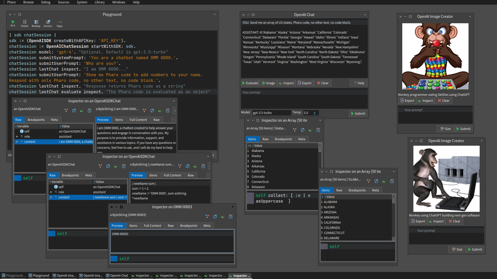

OpenAI-Pharo
============

**A powerful [OpenAI](https://platform.openai.com/) playground for pro-users and developers.**

* Interact with unlimited chatbots using different models, programatically and via GUIs. Evaluate responses to Pharo objects. Export chats as JSON.
* Generate images with different sizes, programatically and via GUIs. Use images as Pharo objects. Export images as PNGs.
* **_Bonus!_** Automatically update Pharo class comments with a generated [Class Responsibility Collaborator](https://en.wikipedia.org/wiki/Class-responsibility-collaboration_card) (based on class definitions and source code).



## Requirements

* [OpenAI](https://platform.openai.com/) API key
* [Pharo 10](https://www.pharo.org/) installation

## Installation

1. Go to <https://platform.openai.com/account/api-keys> to set up an API key.
2. In a [Pharo 10](https://www.pharo.org/) Playground, _Do it_:

```smalltalk
Metacello new 
  repository: 'github://brackendev/OpenAI-Pharo/src';
  baseline: 'OpenAI';
  load.
```

## Example Usage

(An [examples package](https://github.com/brackendev/OpenAI-Pharo/tree/master/OpenAI-Examples) is also included.)

```smalltalk
"Lists the currently available models."

(OpenAISDK createWithAPIKey: 'API_KEY') listModels.
```

```smalltalk
"Programatically use a chat session."

sdk := (OpenAISDK createWithAPIKey: 'API_KEY').
sdk model: 'gpt-4'. "Optional. Default is gpt-3.5-turbo"
chat := OpenAIChat startWithSDK: sdk.
chat submitSystemPrompt: 'You are a chatbot named OMM 0000.'.
chat submitUserPrompt: 'Who are you?'.
chat lastChat. "I am OMM 0000, a language model AI chatbot..."
chat submitUserPrompt: 'Who created you?'.
chat lastChat. "I was created by OpenAI..."
```

```smalltalk
"Programtically generate images"

sdk := (OpenAISDK createWithAPIKey: 'API_KEY').
sdk createImageWithPrompt: 'An elephant drinking water on the moon' number: 2 size: '1024x1024'.
```

```smalltalk
"Open a chat session GUI."
"/export - Export the chat to a JSON file"
"/evaluate - Evaluate the last response as an object"
"/inspect - Inspect the last response"
"/system A new system prompt"

sdk := (OpenAISDK createWithAPIKey: 'API_KEY').
sdk model: 'gpt-4'. "Optional. Default is gpt-3.5-turbo"
OpenAIChatGUI openWithSDK: sdk.
```

```smalltalk
"Open an image generation GUI."
"/export - Export the image to a PNG file"
"/imagesize '256x256' or '512x512' or '1024x1024'"
"/inspect - Inspect the image"

sdk := (OpenAISDK createWithAPIKey: 'API_KEY').
OpenAIImageGUI openWithSDK: sdk.
```

```smalltalk
"Update any class comment with the generated Class Responsibility Collaborator (based on class definitions and source code)."

sdk := (OpenAISDK createWithAPIKey: 'API_KEY').
sdk model: 'gpt-4'. "Optional. Default is gpt-3.5-turbo"
AnyClassYouWant updateCommentWithOpenAICRCWithSDK: sdk.
```

```smalltalk
"Evaluate chat responses to Pharo objects."

sdk := (OpenAISDK createWithAPIKey: 'API_KEY').
chat := OpenAIChat startWithSDK: sdk.
chat submitUserPrompt: 'Return me a list of the US states as a Smalltalk array'.
content := chat lastChat content. "#('Alabama' 'Alaska' 'Arizona' 'Arkansas' ..."
array := Smalltalk compiler evaluate: content.
array size. "50"
array first. "Alabama"
```

## Documentation

### Extension Methods

* [**Class** _classResponsibilityCollaboratorWithSDK_](https://github.com/brackendev/OpenAI-Pharo/blob/f97f77903d201d018b14d8ab6e43c8980c866464/OpenAI/Class.extension.st#L4) - Generate a [Class Responsibility Collaborator](https://en.wikipedia.org/wiki/Class-responsibility-collaboration_card) for a class (based on class definitions and source code).
* [**Class** _definitionAndSourceCode_](https://github.com/brackendev/OpenAI-Pharo/blob/f97f77903d201d018b14d8ab6e43c8980c866464/OpenAI/Class.extension.st#L36) - Retrieve the definition and source code for a class.
* [**Class** _updateCommentWithOpenAICRCWithSDK_](https://github.com/brackendev/OpenAI-Pharo/blob/f97f77903d201d018b14d8ab6e43c8980c866464/OpenAI/Class.extension.st#L46) - Update a class comment with a generated [Class Responsibility Collaborator](https://en.wikipedia.org/wiki/Class-responsibility-collaboration_card).
* [**ImageMorph** _outputPNGFile_](https://github.com/brackendev/OpenAI-Pharo/blob/f97f77903d201d018b14d8ab6e43c8980c866464/OpenAI/ImageMorph.extension.st#L4) - Export an ImageMorph to a PNG file. [OpenAIImageGUI](https://github.com/brackendev/OpenAI-Pharo/blob/master/OpenAI/OpenAIImageGUI.class.st) uses this to export images.
* [**String** _outputTextFile_](https://github.com/brackendev/OpenAI-Pharo/blob/f97f77903d201d018b14d8ab6e43c8980c866464/OpenAI/String.extension.st#L4) - Export a string to a text file. [OpenAIChatGUI](https://github.com/brackendev/OpenAI-Pharo/blob/master/OpenAI/OpenAIChatGUI.class.st) uses this to export chats.

## TODO

- [ ] More testing for errors, token limits, etc.
- [ ] Add documentation for core, GUI, and model classes
- [ ] Test on [Pharo](https://www.pharo.org/) development versions: 11, 12

## Acknowledgements

This project makes use of the following third-party libraries and utilities:

* [NeoJSON](https://github.com/svenvc/NeoJSON)
* [Zinc HTTP Components](https://github.com/svenvc/zinc)

## Author

Bracken Spencer

* [GitHub](https://www.github.com/brackendev)
* [LinkedIn](https://www.linkedin.com/in/brackenspencer/)
* [Mastodon](https://mastodon.cloud/@brackendev)
* [Twitter](https://twitter.com/brackendev)

## License

OpenAI-Pharo is released under the MIT license. See the LICENSE file for more info.
